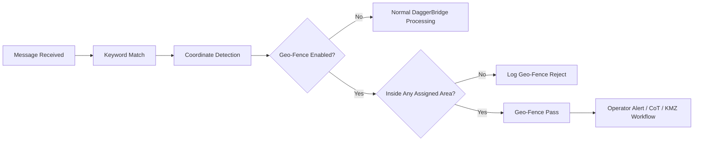

# SOACS DaggerBridge v1.1 — Geo-Fencing Capability Overview

> **Planned release:** DaggerBridge v1.1  
> **Current status:** Active test and validation  
> **Current production release:** v1.0 / RC6 Alpha2 / Hotfix 17

Geo-Fencing is the major capability expansion planned for **SOACS DaggerBridge v1.1**. It adds geographic filtering and map-based operating-area management to the existing keyword, coordinate, alert, CoT, and KMZ workflow.

The objective is to let an operator define **where** a message is operationally relevant without changing the underlying keyword logic. A keyword can remain globally monitored while its geospatial output and/or popup behavior is constrained to one or more operator-defined areas.

## Operational concept

Geo-Fencing does not replace the existing DaggerBridge keyword and coordinate workflow. It adds an optional geographic decision layer between coordinate validation and downstream operator/output actions.

## Geo-Fence types

### Radius

Radius fences use a geographic center plus distance. Current test builds support center entry or map selection and common distance units including nautical miles, statute miles, kilometers, and meters.

Radius geometry is stored geographically and rendered as a geodesic ring rather than a screen-space ellipse so map pan and zoom do not distort the saved area.

### Freehand Area

Operators can trace an irregular closed polygon directly on the offline map. The resulting area is stored using WGS-84 geographic coordinates and can represent operating areas that do not fit a simple circular radius.

### Multi-Area

A single saved Geo-Fence can contain multiple disconnected polygon components. This allows one logical operating area to contain separate geographic regions without including the space between them.

## Reusable and keyword-only areas

DaggerBridge v1.1 is planned to support two complementary workflows:

- **Reusable saved Geo-Fences** — create an area once and assign it to multiple keywords.
- **Keyword-only / one-time Geo-Fences** — create a temporary area that belongs only to one keyword and is not added to the shared library.

A keyword can use multiple saved fences plus a keyword-only fence at the same time.

## Multiple-fence evaluation

Multiple assigned Geo-Fences use **OR / union** logic. A coordinate passes when it is inside or on the boundary of any valid assigned area.

This supports geographically separate areas without creating one oversized fence around all of them. If the same coordinate falls inside overlapping assigned fences, DaggerBridge generates only one downstream event for that coordinate.

An enabled Geo-Fence with no valid assigned or keyword-only areas fails closed.

## Geo-Fence library

The Geo-Fences workspace provides a master library for saved operating areas. Planned v1.1 workflows include:

- Create and name reusable fences
- Edit existing fences
- Rename shared fences while preserving keyword references
- Delete saved fences and clean up their assignments
- Duplicate an existing fence and edit the copy
- Identify whether a fence is user-created or supplied as an out-of-the-box reference
- Reset supplied reference fences to their original starting geometry

Editing a shared saved fence intentionally changes the geometry used by every keyword assigned to that fence, so the application warns the operator before shared edits.

## Geo-Fence Overview

The combined **Geo-Fence Overview** provides a single operating-area picture across active fences.

Current test-build capabilities include:

- Distinct colors for visible fences
- Fence names drawn on the map
- Show/hide controls
- **FIT ALL**
- **FIT SELECTED**
- Direct fence selection from the map or legend
- Overlap highlighting
- Overlap hit reporting and selection cycling
- **EDIT SELECTED**
- **DUPLICATE & EDIT**
- In-place boundary editing while neighboring fences remain visible

Normal Overview interaction remains read-only until the operator intentionally enters an edit workflow.

## Boundary editing and snapping

The v1.1 development track includes direct geometry adjustment tools:

- Draggable polygon vertices
- Midpoint insertion handles
- Whole-area movement
- Multi-Area component selection
- Point deletion
- Undo
- Save / cancel edit
- Radius center and radius handles
- **Snap to Fences** for aligning edited vertices or midpoints to nearby visible fence edges

This is intended to make adjacent operating areas easier to maintain without requiring repeated manual coordinate entry.

## Offline map interaction

Geo-Fence authoring and review are designed for offline use.

Normal map interaction is:

- **Click-drag:** pan
- **Mouse wheel:** zoom
- **Double-click in Radius mode:** select center
- **Draw Area mode:** trace polygon geometry

The redundant PAN MAP button was removed because click-drag is the permanent normal pan behavior.

## Map and geometry integrity

Current test builds reproject saved WGS-84 geometry on map pan and zoom instead of stretching screen-space shapes.

Development corrections include:

- Longitude wrapping across the ±180-degree seam
- Prevention of world-spanning polygon line artifacts
- Geodesic radius-ring rendering
- Dateline-aware fitting behavior
- Detection of impossible/corrupt radius values rather than silently clamping them
- Read-only Overview navigation outside explicit editing

These controls are intended to ensure that moving or zooming the map never changes the underlying saved Geo-Fence geometry.

## Popup behavior

The planned v1.1 alert model separates broad keyword awareness from geography-specific alerting:

- **Popup All** — alert on every enabled keyword match.
- **Popup In Geo-Fence** — alert only when a valid coordinate passes an enabled assigned Geo-Fence.
- Both controls off — no popup for that keyword.

The controls are independent, allowing the operator to choose broad awareness, Geo-Fence-only alerting, both, or neither.

## Summary View

The compact DaggerBridge Summary View includes a read-only world thumbnail showing active Geo-Fences currently in use. Selecting the thumbnail opens the full Geo-Fence Overview.

## Out-of-the-box reference fences

The development track includes operator-adjustable SOC reference starting areas. They are intended as editable starting templates, not authoritative command-boundary products.

Important behavior:

- Reference fences are not automatically assigned to keywords.
- Operators explicitly choose whether to use them.
- They can be adjusted, duplicated, replaced, or ignored.
- User-defined fences remain fully supported.

Operational/customer-specific boundary data is not published in this public repository.

## Configuration and portability

Geo-Fence definitions and assignments are designed to travel with DaggerBridge configuration profiles. Current development includes import-preview awareness for saved reusable areas, keyword-only areas, assignments, and Geo-Fence-enabled keywords.

This allows a configuration package to describe not only message rules but also the geographic areas associated with those rules.

## Operator visibility and troubleshooting

DaggerBridge records Geo-Fence pass/reject decisions so the operator can determine why a coordinate did or did not proceed through the Geo-Fence-controlled workflow.

The design emphasizes visible operator state rather than hidden automation.

## Release path

Geo-Fencing is planned for **DaggerBridge v1.1**. Until testing and release validation are complete:

- v1.0 remains the current production release.
- Geo-Fencing remains a test/development capability.
- Current test-source revisions are not production releases.
- The private source repository remains the controlled location for implementation and test artifacts.

Once v1.1 completes validation and is intentionally promoted, the public project status and release documentation will be updated accordingly.

---

**SOACS DaggerBridge v1.1**  
**Geo-Fencing — planned release capability**
