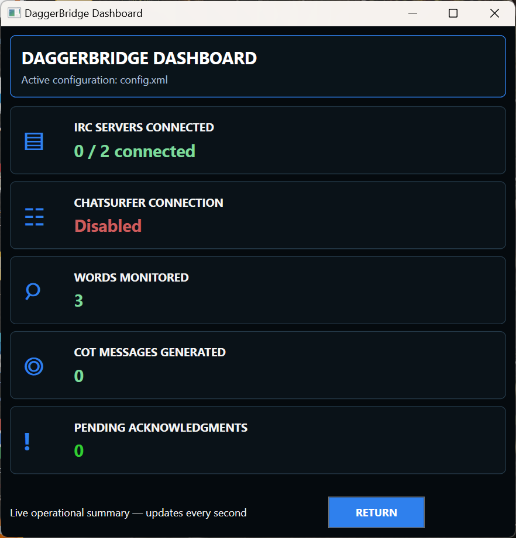
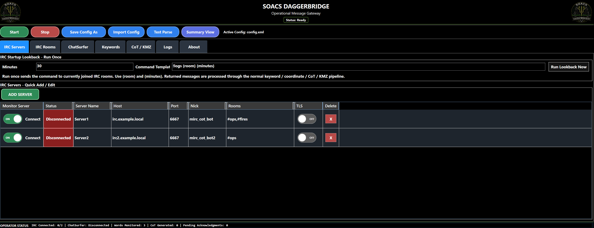
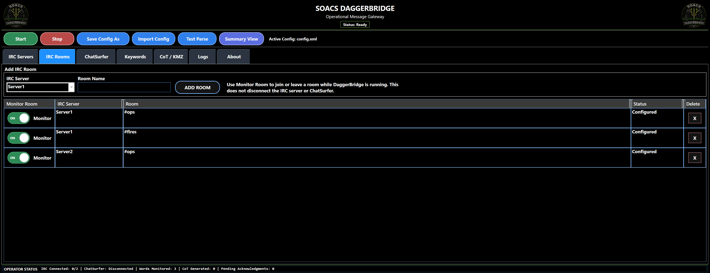
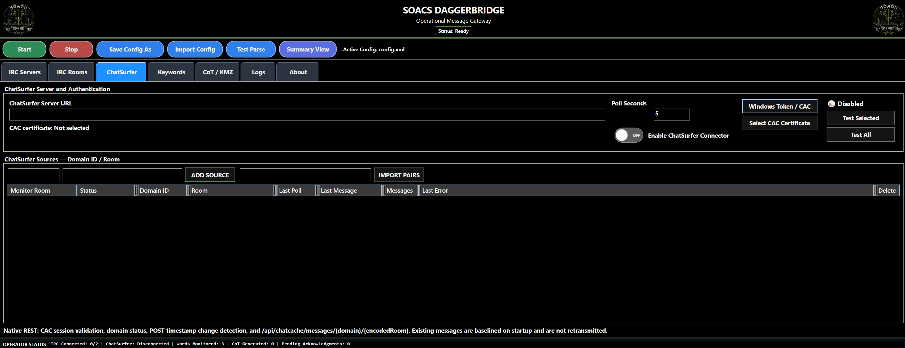
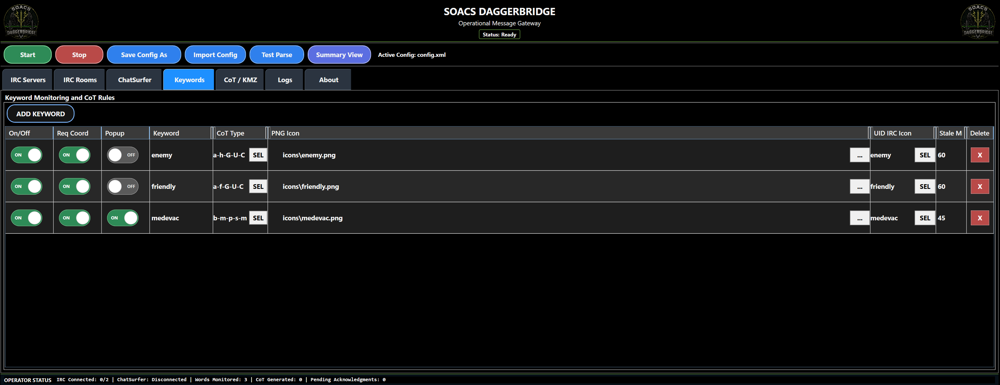
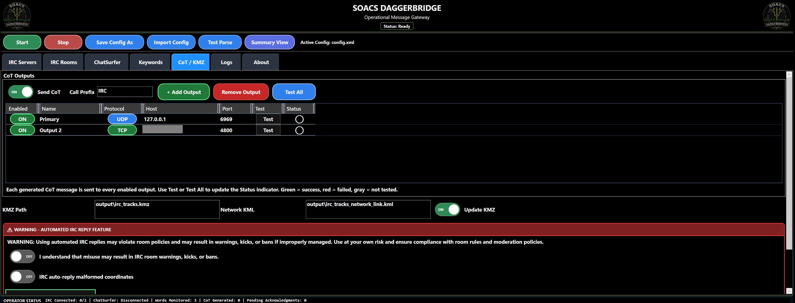
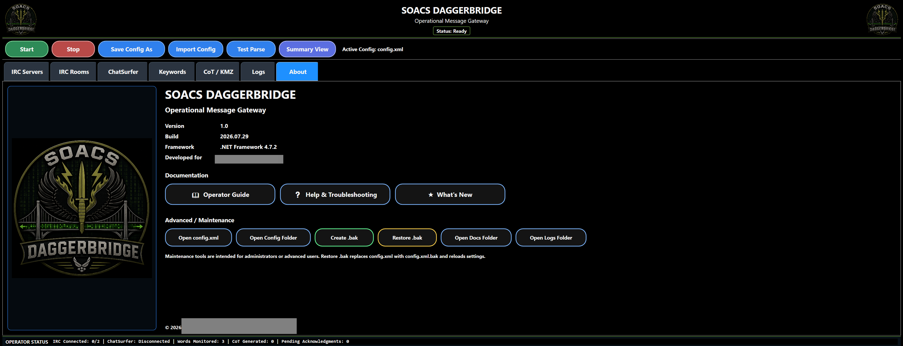
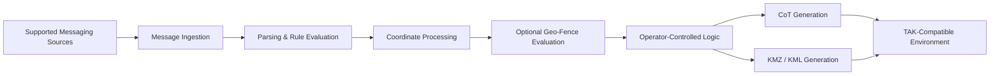

# SOACS DaggerBridge

  

**Tactical Messaging Integration | Cursor-on-Target | Mission Software**

> **Production application — public portfolio repository. Source code and deployment artifacts are maintained privately.**

SOACS DaggerBridge is a Windows mission-support application I designed and developed to bridge supported tactical messaging sources into **Cursor-on-Target (CoT)** data for TAK-compatible environments.

The application was built around a practical integration problem: operators may receive mission-relevant information through messaging systems that do not natively produce CoT. DaggerBridge monitors supported messaging sources, applies operator-defined rules, interprets supported coordinate formats, and creates structured CoT output that can be consumed by TAK-compatible systems.

This repository exists to document the **engineering, capabilities, architecture, and development history** of the application without publishing operational source code, deployment artifacts, configuration data, or environment-specific information.

## Project status

| Item | Status |
|---|---|
| Application | SOACS DaggerBridge |
| Current production release | v1.0 |
| Internal fielded baseline | RC6 Alpha2 / Hotfix 17 |
| Production status | **Released / Production** |
| Planned next release | **v1.1 — Geo-Fencing capability expansion** |
| v1.1 status | **Active test and validation** |
| Latest documented v1.1 test-source revision | **2026.08.27 RevAD** |
| Platform | Windows |
| UI | WPF |
| Language | C# |
| Framework | .NET Framework 4.7.2 |
| Development environment | Visual Studio 2019 |
| External package dependency | None required |
| Source availability | **Private** |

The released v1.0 / RC6 Alpha2 / Hotfix 17 baseline remains the production release. **Geo-Fencing is planned for DaggerBridge v1.1** and remains in active test/development until validation and formal release promotion are complete.

## What DaggerBridge does

DaggerBridge provides a controlled bridge between tactical messaging workflows and TAK/CoT-enabled environments.

Core capabilities include:

- Monitoring multiple IRC servers and rooms
- ChatSurfer connector support
- Operator-defined keyword and coordinate rules
- Recognition and processing of supported coordinate formats
- MGRS-to-WGS84 coordinate conversion
- Cursor-on-Target generation
- CoT output over UDP and TCP
- KMZ/KML generation
- Configurable CoT type, icon, stale time, and alert behavior
- Message replay for offline testing and validation
- Named configuration profiles
- Operator summary/status view
- Raw messaging and CoT troubleshooting views
- Controlled shutdown of network and background processes

The planned **v1.1 Geo-Fencing release** adds operator-defined geographic filtering, reusable and one-time operating areas, combined overview mapping, multi-area support, direct boundary editing, and fence-to-fence snapping while retaining operator control over when and where message matches become eligible for CoT/KMZ output.

## Released v1.0 application screenshots

The screenshots below show the **released DaggerBridge v1.0 interface** using sanitized/example configuration data. They are intentionally separated from the v1.1 Geo-Fencing development material later in this repository.

### Operator dashboard

The compact dashboard provides an at-a-glance operational summary of messaging connectivity, monitored words, generated CoT messages, and pending acknowledgments without requiring the operator to remain in the full configuration interface.

  

### IRC server management

Multiple IRC servers can be configured and monitored independently, with room membership, connection state, TLS selection, startup lookback, and per-server controls visible from one screen.

  

### IRC room monitoring

Rooms are associated with their configured IRC servers and can be individually enabled or disabled for monitoring while DaggerBridge remains running.

  

### ChatSurfer connector

The ChatSurfer interface provides connector configuration, CAC/Windows-token authentication options, polling controls, domain/room source management, and source-level status visibility.

  

### Keyword and CoT rules

Operators can enable or disable monitored keywords, require coordinates, control popup behavior, select CoT types and icons, and configure stale times from the keyword rule grid.

  

### CoT and KMZ outputs

DaggerBridge supports multiple enabled CoT destinations using UDP or TCP while also maintaining KMZ/KML output. The released interface includes explicit output testing and guarded controls around automated reply behavior.

  

### About, documentation, and maintenance

The released About page identifies the v1.0 build and framework while providing direct access to operator documentation, troubleshooting material, configuration backup/restore tools, and maintenance folders.

  

## High-level workflow

The public diagram intentionally represents the application only at a conceptual level. Connection details, configuration structures, authentication data, operational mappings, and deployment architecture are not published.

## Engineering goals

DaggerBridge was designed around several constraints common to fielded and disconnected environments:

**Offline operation.** The application does not depend on cloud services or runtime package retrieval and is designed to build and operate in controlled/offline environments.

**Operator control.** Automated response behavior requires human-in-the-loop approval. The application is intended to assist the operator rather than silently make operational decisions on the operator's behalf.

**Traceability.** Message handling, CoT output, alerts, configuration selection, Geo-Fence pass/reject decisions, and troubleshooting information are surfaced so the operator can understand what the application is doing.

**Configuration flexibility.** Operators can maintain named configuration profiles and change rules without redesigning the application for each use case.

**Resilient field behavior.** Development has included handling for network disconnects, duplicate IRC nicknames, malformed coordinates, configuration fallback, background-process shutdown, offline replay testing, and map/geometry integrity during Geo-Fence pan and zoom operations.

## Coordinate handling

DaggerBridge supports the coordinate-processing workflow required to turn message content into useful geospatial data. Development has included support for multiple coordinate representations, including MGRS and common latitude/longitude formats, along with malformed-coordinate detection and operator alerting.

The application separates message detection from geospatial output so that invalid or incomplete coordinate data is not blindly treated as a valid location.

## Geo-Fencing — planned v1.1 release

The Geo-Fencing expansion is designed to let operators control **where** a keyword match is operationally relevant, not just whether the text itself matched.

Current v1.1 test-source capabilities include:

- Reusable saved Geo-Fences that can be assigned to multiple keywords
- Keyword-only / one-time Geo-Fences for temporary use
- Radius fences using center + distance
- Freehand polygon areas drawn on the embedded offline map
- Multi-Area Geo-Fences made from multiple disconnected polygons under one saved fence name
- Multiple saved fences assigned to one keyword using **OR / union** evaluation
- Boundary-inclusive containment
- A combined **Geo-Fence Overview** showing active areas, names, visibility state, and overlaps
- A compact Summary View map of active Geo-Fences
- **FIT ALL** and **FIT SELECTED** map controls
- Direct selection of fences from the map or legend
- Shared-fence edit warnings when one saved area is used by multiple keywords
- **Duplicate & Edit** to create a new user fence from an existing geometry
- Vertex and midpoint boundary editing
- Whole-area movement for polygon components
- Undo and point deletion during editing
- In-place Overview boundary editing while neighboring fences remain visible
- **Snap to Fences** so edited vertices/midpoints can align to nearby visible fence edges
- Distinct **Popup All** and **Popup In Geo-Fence** behavior
- Geo-Fence PASS/REJECT logging for operator troubleshooting

The v1.1 development track also includes out-of-the-box SOC reference starting areas. These are intentionally editable **reference templates**, not authoritative command-boundary products, and are never automatically assigned to keywords.

### Geo-Fence alert behavior

The v1.1 design separates general keyword alerting from geography-specific alerting:

- **Popup All** — alerts on every enabled keyword match.
- **Popup In Geo-Fence** — alerts only after a valid coordinate passes an enabled assigned Geo-Fence.
- Turning both off disables keyword popups.

This lets the operator choose between broad awareness and location-restricted alerting without changing the underlying keyword definition.

### Map and geometry integrity

Geo-Fence geometry is stored geographically rather than as screen-space shapes. Current v1.1 test builds reproject saved WGS-84 geometry whenever the map pans or zooms, handle the ±180-degree longitude seam, render radius areas as geodesic rings, and keep Overview navigation read-only unless the operator intentionally enters an edit workflow.

This prevents map interaction from stretching or rewriting saved fence geometry.

See [DaggerBridge v1.1 Geo-Fencing Capability Overview](GEOFENCING.md) for a more detailed capability summary.

## Operator-focused design

The UI was developed around direct operational use rather than a generic messaging client. Major interface areas provide visibility into:

- Messaging-source connection state
- CoT output state
- Last received message
- Last generated CoT event
- Alert activity
- Active configuration profile
- Raw message traffic
- CoT troubleshooting output
- Geo-Fence assignment and pass/reject state in the planned v1.1 workflow

A compact summary view provides at-a-glance status while allowing the full application to remain available for detailed configuration and troubleshooting.

## Development approach

DaggerBridge was developed iteratively from real workflow requirements. Features were placed in front of users early, issues were identified from actual use, and corrections were incorporated directly into subsequent builds.

Examples of production hardening and current v1.1 development work include:

- Improving IRC server/room handling
- Handling nickname reuse and connection-state issues
- Expanding coordinate parsing and malformed-coordinate detection
- Improving configuration import and active-profile persistence
- Adding backup/fallback behavior for configuration changes
- Improving dark-mode and DPI-related UI behavior
- Adding operator alerts and troubleshooting output
- Correcting application shutdown so background processes terminate cleanly
- Adding reusable, keyword-only, radius, freehand, and Multi-Area Geo-Fence workflows
- Adding Overview and Summary map visualization
- Adding boundary handles, area movement, undo, and point deletion
- Adding visible-neighbor boundary snapping during Overview editing
- Correcting world-wrap and pan/zoom geometry behavior

The production source baseline and active v1.1 development source are maintained under controlled version management in a private repository.

## Security and source availability

**The DaggerBridge source repository is intentionally private.**

This public repository does **not** contain:

- Application source code
- Compiled executables or installers
- Operational configuration files
- Credentials, certificates, keys, or authentication material
- Real server, room, host, IP, or network mappings
- Operational logs or message traffic
- Customer/site-specific information
- Deployment packages
- Security-assessment artifacts
- Operational Geo-Fence coordinates or customer-specific boundary definitions

DaggerBridge has undergone security testing and controlled deployment review appropriate to its operational environment. Detailed security documentation and deployment artifacts are not published here.

## Why this repository is public

The objective is to make the engineering work visible without exposing the implementation or the environments it supports.

For recruiters, engineers, and technical leaders, this repository demonstrates experience with:

- Systems integration
- Tactical communications integration
- TAK / Cursor-on-Target workflows
- Windows desktop application engineering
- Network programming
- Coordinate parsing and geospatial data handling
- Geo-Fence and map-based operator workflow design
- Human-in-the-loop workflow design
- Offline / disconnected software engineering
- Operator-driven requirements development
- Production hardening and field support

## Release path

**Current production:** DaggerBridge v1.0 / RC6 Alpha2 / Hotfix 17  
**Planned next release:** DaggerBridge v1.1 — Geo-Fencing

The v1.1 Geo-Fencing capability will remain identified as test/development work until the build completes validation and is intentionally promoted to production.

## Development ownership

**Designed and developed by William F. Owen Jr.** as part of his work supporting SOACS.

The application reflects a broader engineering approach: identify operational friction, work directly with the people performing the task, build a usable capability quickly, and improve it through direct feedback and testing.

---

**SOACS DaggerBridge**  
**Engineering the Warfighter's Advantage.**
