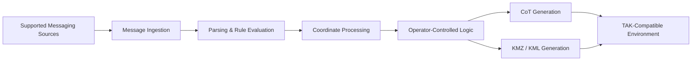

# SOACS DaggerBridge

  

**Tactical Messaging Integration | Cursor-on-Target | Mission Software**

> **Production application — public portfolio repository. Source code and deployment artifacts are maintained privately.**

SOACS DaggerBridge is a Windows mission-support application I designed and developed to bridge supported tactical messaging sources into **Cursor-on-Target (CoT)** data for TAK-compatible environments.

The application was built around a practical integration problem: operators may receive mission-relevant information through messaging systems that do not natively produce CoT. DaggerBridge monitors supported messaging sources, applies operator-defined rules, interprets supported coordinate formats, and creates structured CoT output that can be consumed by TAK-compatible systems.

This repository exists to document the **engineering, capabilities, architecture, and development history** of the application without publishing operational source code, deployment artifacts, configuration data, or environment-specific information.

## Project status

| Item | Status |
|---|---|
| Application | SOACS DaggerBridge |
| Current production release | v1.0 |
| Internal fielded baseline | RC6 Alpha2 / Hotfix 17 |
| Status | **Released / Production** |
| Platform | Windows |
| UI | WPF |
| Language | C# |
| Framework | .NET Framework 4.7.2 |
| Development environment | Visual Studio 2019 |
| External package dependency | None required |
| Source availability | **Private** |

## What DaggerBridge does

DaggerBridge provides a controlled bridge between tactical messaging workflows and TAK/CoT-enabled environments.

Core capabilities include:

- Monitoring multiple IRC servers and rooms
- ChatSurfer connector support
- Operator-defined keyword and coordinate rules
- Recognition and processing of supported coordinate formats
- MGRS-to-WGS84 coordinate conversion
- Cursor-on-Target generation
- CoT output over UDP and TCP
- KMZ/KML generation
- Configurable CoT type, icon, stale time, and alert behavior
- Message replay for offline testing and validation
- Named configuration profiles
- Operator summary/status view
- Raw messaging and CoT troubleshooting views
- Controlled shutdown of network and background processes

## High-level workflow

The public diagram intentionally represents the application only at a conceptual level. Connection details, configuration structures, authentication data, operational mappings, and deployment architecture are not published.

## Engineering goals

DaggerBridge was designed around several constraints common to fielded and disconnected environments:

**Offline operation.** The application does not depend on cloud services or runtime package retrieval and is designed to build and operate in controlled/offline environments.

**Operator control.** Automated response behavior requires human-in-the-loop approval. The application is intended to assist the operator rather than silently make operational decisions on the operator's behalf.

**Traceability.** Message handling, CoT output, alerts, configuration selection, and troubleshooting information are surfaced so the operator can understand what the application is doing.

**Configuration flexibility.** Operators can maintain named configuration profiles and change rules without redesigning the application for each use case.

**Resilient field behavior.** Development has included handling for network disconnects, duplicate IRC nicknames, malformed coordinates, configuration fallback, background-process shutdown, and offline replay testing.

## Coordinate handling

DaggerBridge supports the coordinate-processing workflow required to turn message content into useful geospatial data. Development has included support for multiple coordinate representations, including MGRS and common latitude/longitude formats, along with malformed-coordinate detection and operator alerting.

The application separates message detection from geospatial output so that invalid or incomplete coordinate data is not blindly treated as a valid location.

## Operator-focused design

The UI was developed around direct operational use rather than a generic messaging client. Major interface areas provide visibility into:

- Messaging-source connection state
- CoT output state
- Last received message
- Last generated CoT event
- Alert activity
- Active configuration profile
- Raw message traffic
- CoT troubleshooting output

A compact summary view provides at-a-glance status while allowing the full application to remain available for detailed configuration and troubleshooting.

## Development approach

DaggerBridge was developed iteratively from real workflow requirements. Features were placed in front of users early, issues were identified from actual use, and corrections were incorporated directly into subsequent builds.

Examples of production hardening included:

- Improving IRC server/room handling
- Handling nickname reuse and connection-state issues
- Expanding coordinate parsing and malformed-coordinate detection
- Improving configuration import and active-profile persistence
- Adding backup/fallback behavior for configuration changes
- Improving dark-mode and DPI-related UI behavior
- Adding operator alerts and troubleshooting output
- Correcting application shutdown so background processes terminate cleanly

The current production source baseline is maintained under controlled version management in a private repository.

## Security and source availability

**The DaggerBridge source repository is intentionally private.**

This public repository does **not** contain:

- Application source code
- Compiled executables or installers
- Operational configuration files
- Credentials, certificates, keys, or authentication material
- Real server, room, host, IP, or network mappings
- Operational logs or message traffic
- Customer/site-specific information
- Deployment packages
- Security-assessment artifacts

DaggerBridge has undergone security testing and controlled deployment review appropriate to its operational environment. Detailed security documentation and deployment artifacts are not published here.

## Why this repository is public

The objective is to make the engineering work visible without exposing the implementation or the environments it supports.

For recruiters, engineers, and technical leaders, this repository demonstrates experience with:

- Systems integration
- Tactical communications integration
- TAK / Cursor-on-Target workflows
- Windows desktop application engineering
- Network programming
- Coordinate parsing and geospatial data handling
- Human-in-the-loop workflow design
- Offline / disconnected software engineering
- Operator-driven requirements development
- Production hardening and field support

## Development ownership

**Designed and developed by William F. Owen Jr.** as part of his work supporting SOACS.

The application reflects a broader engineering approach: identify operational friction, work directly with the people performing the task, build a usable capability quickly, and improve it through direct feedback and testing.

---

**SOACS DaggerBridge**  
**Engineering the Warfighter's Advantage.**
