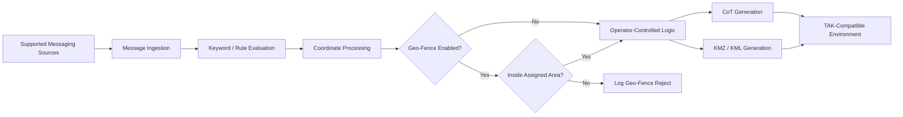

# SOACS DaggerBridge

  

**Tactical Messaging Integration | Cursor-on-Target | Geo-Fencing | Mission Software**

> **Production application — public portfolio repository. Source code and deployment artifacts are maintained privately.**

SOACS DaggerBridge is a Windows mission-support application I designed and developed to bridge supported tactical messaging sources into **Cursor-on-Target (CoT)** data for TAK-compatible environments.

DaggerBridge addresses a practical integration problem: mission-relevant information may arrive through messaging systems that do not natively produce CoT. The application monitors supported messaging sources, applies operator-defined rules, interprets supported coordinate formats, optionally evaluates those coordinates against operator-defined Geo-Fences, and creates structured geospatial output for TAK-compatible systems.

This repository documents the **engineering, capabilities, architecture, and development history** of the application without publishing operational source code, deployment artifacts, configuration data, or environment-specific information.

## Project status

| Item | Status |
|---|---|
| Application | SOACS DaggerBridge |
| Current production release | **v1.1** |
| Major v1.1 capability | **Geo-Fencing** |
| Production status | **Released / Production** |
| Previous production baseline | v1.0 / RC6 Alpha2 / Hotfix 17 |
| Platform | Windows |
| UI | WPF |
| Language | C# |
| Framework | .NET Framework 4.7.2 |
| Development environment | Visual Studio 2019 |
| External package dependency | None required |
| Source availability | **Private** |

**DaggerBridge v1.1 is the current released production version.** Geo-Fencing is now part of the production capability set.

## What DaggerBridge does

DaggerBridge provides a controlled bridge between tactical messaging workflows and TAK/CoT-enabled environments.

Core capabilities include:

- Monitoring multiple IRC servers and rooms
- ChatSurfer connector support
- Operator-defined keyword and coordinate rules
- Recognition and processing of supported coordinate formats
- MGRS-to-WGS84 coordinate conversion
- **Geo-Fence filtering by keyword and coordinate**
- Reusable, keyword-only, radius, freehand, and Multi-Area Geo-Fences
- Geo-Fence Overview and Summary map visualization
- Direct boundary editing and fence-to-fence snapping
- Cursor-on-Target generation
- CoT output over UDP and TCP
- KMZ/KML generation
- Configurable CoT type, icon, stale time, and alert behavior
- Message replay for offline testing and validation
- Named configuration profiles
- Operator summary/status view
- Raw messaging and CoT troubleshooting views
- Controlled shutdown of network and background processes

## High-level workflow

The public diagram intentionally represents the application only at a conceptual level. Connection details, configuration structures, authentication data, operational mappings, and deployment architecture are not published.

## Geo-Fencing — released in v1.1

DaggerBridge v1.1 adds an optional geographic decision layer to the existing keyword and coordinate workflow. Operators can control **where** a keyword match is relevant, rather than relying on text matching alone.

Released Geo-Fencing capabilities include:

- **Reusable saved Geo-Fences** that can be assigned to multiple keywords
- **Keyword-only / one-time Geo-Fences** for temporary use
- **Radius** fences defined by center and distance
- **Freehand Area** polygons drawn on the embedded offline map
- **Multi-Area** fences containing multiple disconnected polygon components
- Multiple assigned fences using **OR / union** evaluation
- Boundary-inclusive containment
- A combined **Geo-Fence Overview** showing visible areas, names, selection state, and overlaps
- A compact Summary View map of active Geo-Fences
- **FIT ALL** and **FIT SELECTED** controls
- Direct fence selection from the map or legend
- Shared-fence edit warnings
- **Duplicate & Edit** for creating a new user fence from existing geometry
- Vertex and midpoint boundary editing
- Whole-area movement and Multi-Area component editing
- Undo and point deletion during editing
- **Snap to Fences** for aligning edited geometry to neighboring visible fence edges
- Separate **Popup All** and **Popup In Geo-Fence** behavior
- Geo-Fence PASS/REJECT logging for troubleshooting
- Operator-adjustable out-of-the-box SOC reference starting areas

The supplied SOC areas are editable **reference templates**, not authoritative command-boundary products, and are never automatically assigned to keywords.

### Geo-Fence alert behavior

The v1.1 alert model separates broad keyword awareness from geography-specific alerting:

- **Popup All** — alerts on every enabled keyword match.
- **Popup In Geo-Fence** — alerts only when a valid coordinate passes an enabled assigned Geo-Fence.
- Both controls off — no popup for that keyword.

This allows the operator to choose broad awareness, Geo-Fence-only alerting, both, or neither without changing the underlying keyword definition.

### Map and geometry integrity

Geo-Fence geometry is stored geographically rather than as screen-space shapes. DaggerBridge reprojects saved WGS-84 geometry whenever the map pans or zooms, handles the ±180-degree longitude seam, renders radius areas as geodesic rings, and keeps normal Overview navigation read-only until the operator intentionally enters an edit workflow.

This prevents map interaction from stretching or rewriting saved fence geometry.

See [DaggerBridge v1.1 Geo-Fencing Capability Overview](GEOFENCING.md) for the detailed Geo-Fencing workflow and feature set.

## Coordinate handling

DaggerBridge supports the coordinate-processing workflow required to turn message content into useful geospatial data. The application supports multiple coordinate representations, including MGRS and common latitude/longitude formats, along with malformed-coordinate detection and operator alerting.

Message detection is separated from geospatial output so invalid or incomplete coordinate data is not blindly treated as a valid location. When Geo-Fencing is enabled, a valid coordinate must also satisfy the assigned geographic rule before the Geo-Fence-controlled output workflow proceeds.

## Operator-focused design

The UI was developed around direct operational use rather than a generic messaging client. Major interface areas provide visibility into:

- Messaging-source connection state
- CoT output state
- Last received message
- Last generated CoT event
- Alert activity
- Active configuration profile
- Raw message traffic
- CoT troubleshooting output
- Geo-Fence assignments and pass/reject state
- Active operating areas and overlaps

A compact summary view provides at-a-glance status while allowing the full application to remain available for configuration, Geo-Fence management, and troubleshooting.

## Application screenshots

The screenshots below show the original **v1.0 production interface baseline** using sanitized/example configuration data. DaggerBridge v1.1 retains the core workflow shown here and adds the released Geo-Fencing workspace, map, and keyword Geo-Fence controls described above.

### Operator dashboard

The compact dashboard provides an at-a-glance operational summary of messaging connectivity, monitored words, generated CoT messages, and pending acknowledgments without requiring the operator to remain in the full configuration interface.

  

### IRC server management

Multiple IRC servers can be configured and monitored independently, with room membership, connection state, TLS selection, startup lookback, and per-server controls visible from one screen.

  

### IRC room monitoring

Rooms are associated with their configured IRC servers and can be individually enabled or disabled for monitoring while DaggerBridge remains running.

  

### ChatSurfer connector

The ChatSurfer interface provides connector configuration, CAC/Windows-token authentication options, polling controls, domain/room source management, and source-level status visibility.

  

### Keyword and CoT rules

Operators can enable or disable monitored keywords, require coordinates, control popup behavior, select CoT types and icons, and configure stale times from the keyword rule grid. v1.1 extends this workflow with per-keyword Geo-Fence assignment and geographic filtering.

  

### CoT and KMZ outputs

DaggerBridge supports multiple enabled CoT destinations using UDP or TCP while also maintaining KMZ/KML output. The interface includes explicit output testing and guarded controls around automated reply behavior.

  

### About, documentation, and maintenance

The baseline About page provides direct access to operator documentation, troubleshooting material, configuration backup/restore tools, and maintenance folders.

  

## Engineering goals

DaggerBridge was designed around constraints common to fielded and disconnected environments:

**Offline operation.** The application does not depend on cloud services or runtime package retrieval and is designed to build and operate in controlled/offline environments.

**Operator control.** Automated response behavior requires human-in-the-loop approval. The application is intended to assist the operator rather than silently make operational decisions on the operator's behalf.

**Traceability.** Message handling, CoT output, alerts, configuration selection, Geo-Fence pass/reject decisions, and troubleshooting information are surfaced so the operator can understand what the application is doing.

**Configuration flexibility.** Operators can maintain named configuration profiles, message rules, and geographic areas without redesigning the application for each use case.

**Resilient field behavior.** Development has included handling for network disconnects, duplicate IRC nicknames, malformed coordinates, configuration fallback, background-process shutdown, offline replay testing, map world-wrap, and Geo-Fence geometry integrity during pan and zoom operations.

## Development approach

DaggerBridge was developed iteratively from real workflow requirements. Features were placed in front of users early, issues were identified from actual use, and corrections were incorporated directly into subsequent builds.

Examples of production hardening include:

- Improving IRC server/room handling
- Handling nickname reuse and connection-state issues
- Expanding coordinate parsing and malformed-coordinate detection
- Improving configuration import and active-profile persistence
- Adding backup/fallback behavior for configuration changes
- Improving dark-mode and DPI-related UI behavior
- Adding operator alerts and troubleshooting output
- Correcting application shutdown so background processes terminate cleanly
- Adding reusable, keyword-only, radius, freehand, and Multi-Area Geo-Fence workflows
- Adding Overview and Summary Geo-Fence visualization
- Adding boundary handles, area movement, undo, and point deletion
- Adding visible-neighbor boundary snapping
- Correcting antimeridian/world-wrap and pan/zoom geometry behavior

The production source baseline and future development are maintained under controlled version management in a private repository.

## Security and source availability

**The DaggerBridge source repository is intentionally private.**

This public repository does **not** contain:

- Application source code
- Compiled executables or installers
- Operational configuration files
- Credentials, certificates, keys, or authentication material
- Real server, room, host, IP, or network mappings
- Operational logs or message traffic
- Customer/site-specific information
- Deployment packages
- Security-assessment artifacts
- Operational Geo-Fence coordinates or customer-specific boundary definitions

DaggerBridge has undergone security testing and controlled deployment review appropriate to its operational environment. Detailed security documentation and deployment artifacts are not published here.

## Why this repository is public

The objective is to make the engineering work visible without exposing the implementation or the environments it supports.

For recruiters, engineers, and technical leaders, this repository demonstrates experience with:

- Systems integration
- Tactical communications integration
- TAK / Cursor-on-Target workflows
- Windows desktop application engineering
- Network programming
- Coordinate parsing and geospatial data handling
- Geo-Fence and map-based operator workflow design
- Human-in-the-loop workflow design
- Offline / disconnected software engineering
- Operator-driven requirements development
- Production hardening and field support

## Release history

**Current production:** **DaggerBridge v1.1 — Geo-Fencing**  
**Previous production baseline:** DaggerBridge v1.0 / RC6 Alpha2 / Hotfix 17

v1.1 promotes the Geo-Fencing capability set into the released production application while retaining the core multi-source messaging, coordinate-processing, CoT, KMZ/KML, configuration, and operator-control workflows established in v1.0.

## Development ownership

**Designed and developed by William F. Owen Jr.** as part of his work supporting SOACS.

The application reflects a broader engineering approach: identify operational friction, work directly with the people performing the task, build a usable capability quickly, and improve it through direct feedback and testing.

---

**SOACS DaggerBridge v1.1**  
**Engineering the Warfighter's Advantage.**
